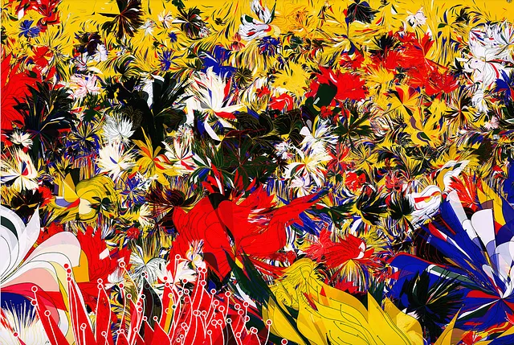
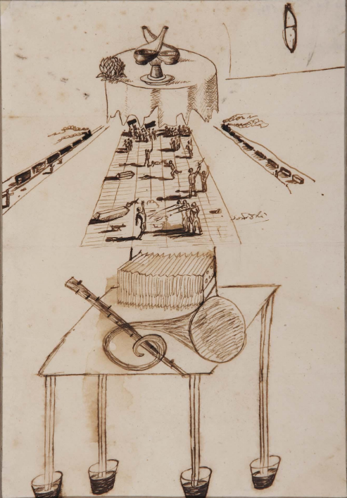
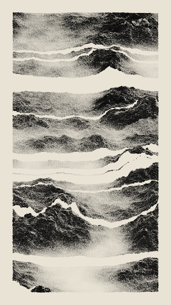
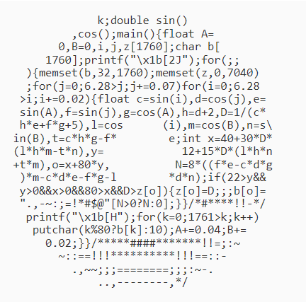
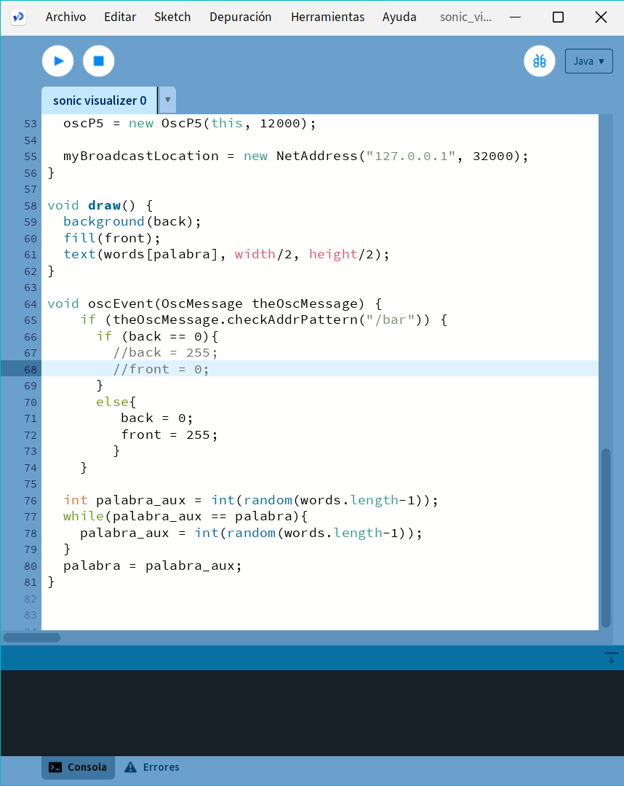
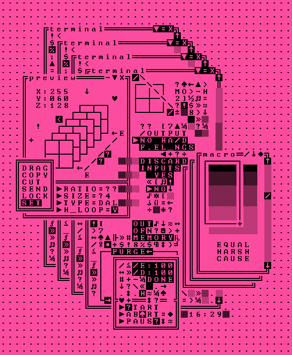
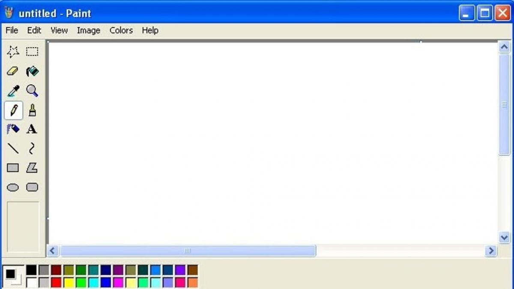
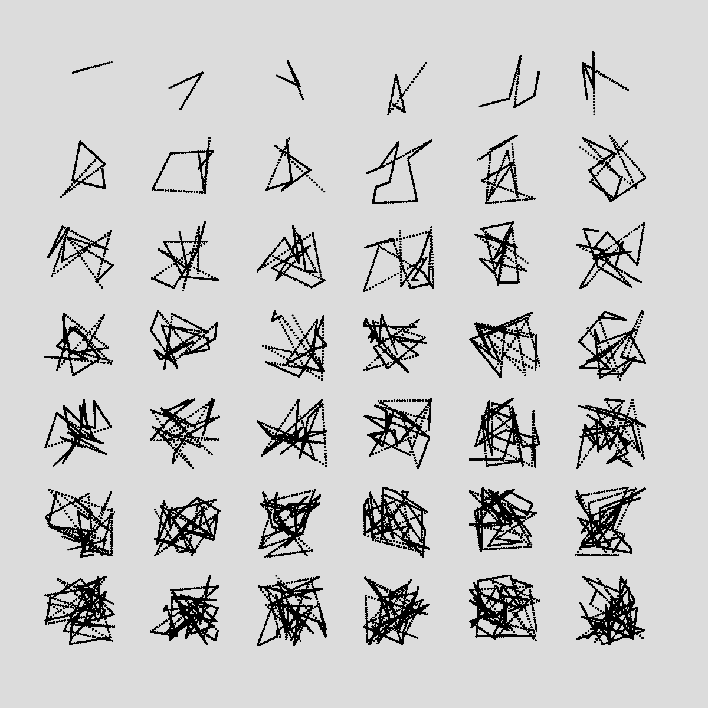
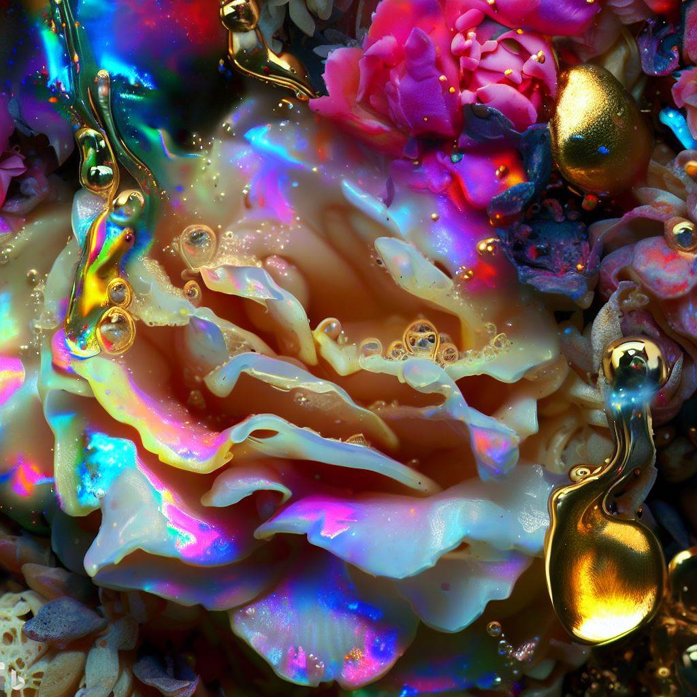

# D1
## Subtext
Lorem ipsum dolor emet

---
# Arte generativo
Práctica artística que utiliza un **sistema de reglas establecidas** de antemano, que determinan el proceso y el desarrollo de la obra de arte.

---
# No es una estética

Es un proceso que se utiliza en **cualquier** medio.

---

# No automatizamos la creación de arte
Es una forma de explorar ideas hasta llegar a un resultado.

---
# Codigo como arte
Este proceso difumina la linea entre el arte visual, el lenguaje y programación.
El propio sistema puede ser considerado como una obra de arte.

["Code is" de ertdfgcvb](https://ertdfgcvb.xyz/+/svg.svg/)
["donut.c" de Andy Sloane](https://www.a1k0n.net/2011/07/20/donut-math.html)

---
# Arte como herramienta
Los programas de Processing se conocen como Sketches.
Al igual que un boceto, es una herramienta para explorar nuevas ideas y probar conceptos.
[Virtual Massage 15](https://visual-massage.com/massages/15)

---
# Todos 
 creamos reglas internas, de manera consciente o inconsciente, que nos ayudan a crear.

---

# Proceso clásico

---

# Software de edición
- 👍 Posibilidad de extenderse (plug-ins, addons, mods...)
- 👍 Es mas amigable para el usuario final
- 👍 Herramientas analogas del mundo fisico al digital
- 💀 Entorno limitado por interfaz
- 💀 Proyectos más cerrados

---
# Proceso generativo

---

# Código

- ❤️ Posibilidad de extenderse (librerias, frameworks...)
- ❤️ Reutilización de código
- ❤️ Simplificamos tareas repetitivas
- 😢 Flujo de trabajo diferente
- 😢 Entorno que no inspira la creatividad

---
# Processing
- Java
- Creado en 2001 por Casey Reas y Ben Fry
- Proyecto de código abierto
- [processing.org](https://processing.org)

---
- Basado en JavaScript
- Creado por Lauren McCarthy en 2014
- Proyecto de código abierto
- Editor online
- Orientado a web
- [p5js.org](https://p5js.org)

---

- 🎨 Lenguaje enfocado a artistas
- 🔥 Entorno sencillo de instalar y usar
- 📖 Documentación clara
- ❤️ Comunidad activa

---

# Vamos a crear algunas formas
# 👇
[Editor online](https://editor.p5js.org/)
[sin() cos()](https://editor.p5js.org/skycstls/sketches/rfVd6HwBf)

---

# Ciclo de vida p5js

---

# Aleatoriedad
## random(min, max)
[lerp](https://editor.p5js.org/skycstls/sketches/Zg8rYFSDZ)

---
# Paletas de color generativas
color(a, b, c)
colorMode(MODE)
- RGB
- HSB
- HSL
  
[Espacios de color](https://editor.p5js.org/skycstls/sketches/zcfIEA_wu)
[Creando paletas](https://editor.p5js.org/skycstls/sketches/ULUQcHYg5)

---

# Random walkers
Up, down, left, right
[Add](https://editor.p5js.org/skycstls/sketches/kJD9eCa5H)
[Espejo](https://editor.p5js.org/skycstls/sketches/70MwWVriM)

---

# Ruido perlin
noise(x)
[Comparacion random vs noise](https://editor.p5js.org/skycstls/sketches/sF7o7Api6)
[Proyeccion de puntos](https://editor.p5js.org/skycstls/sketches/VlCf1_VUL)
[Trayectoria y tamaño](https://editor.p5js.org/skycstls/sketches/BYtI3-qHQ)
[Noise ellipse](https://editor.p5js.org/skycstls/sketches/j2FTPNC2s)
[Cyber sigil](https://editor.p5js.org/skycstls/sketches/_ccv8Y3Yp)

---
# Imagenes

[Scanner](https://editor.p5js.org/skycstls/sketches/4iBynuwJT)
[Brush](https://editor.p5js.org/skycstls/sketches/6-5rjJjjA)
[Collage digital](https://editor.p5js.org/skycstls/sketches/25oWZ76uY)

---

# Texto
[Unicode explorer](https://editor.p5js.org/skycstls/sketches/DyaiCe-9y)
[Unicode mangler](https://editor.p5js.org/skycstls/sketches/GFn8Y915W)

---

# Game of life
[GOL básico]()

---

# Sistemas L
Generamos un set de ordenes + un sistema de interpretacion

---

# Sistema original Lindenmayer
## Simulación del crecimiento de algas
Variables: A B
Reglas:
A -> AB
B -> A

---

---

# Curva de Koch

---

# Arbol fractal
[](https://mermaid.live/edit#pako:eNptkstOwzAQRX_Fmi1tFdtp0maBFOiWDSCQiLMYEtNaSuziODxa9d-xE8JD4E0899y5Gdk-QmVqCRk8Nea12qF15HYjdFQIuJbbBrtMaOJXRM4JLaIyGksaSiqgFFpo5s2XRncOtZNTQ0HGbzmYqLfcoVX42Hw5pqgphczn50Gk00bo3Lflb8q0-NUTzPnguPBwHAnKIFyGmhaDVP4EZDOQwH7h8o97_LnvuC_yqlJGy45gZyqFNXZj1oPPGmeZjiV_QX3Ab43-oxVe2_fd7myrrCG1tNKf9TcuAzb7karDc6-krX_wYTT2ORrMoJW2RVX7azsGkwC3k60UkPlto7Y7F2Y8eSP2zty86woyZ3s5g35fo5MbhVuLLWRP2HRe3aOG7AhvkM15ki7SdMlivuJrvlryGbxDxtgiSWjM4oStebpMI3aawcEYH0EXqzRNKY85p-uEx2w55D0M8DNf1soZezU-tOG9nT4A_lGx8w)

---

# Recursos adicionales
[The Algorithmic Beauty of Plants](http://algorithmicbotany.org/papers/)
[Superfractals](https://books.google.es/books?id=iO0B3xF65SIC&lpg=PA74&hl=es&pg=PA7#v=onepage&q&f=false)
[Wikipedia](https://en.wikipedia.org/wiki/L-system)

---
